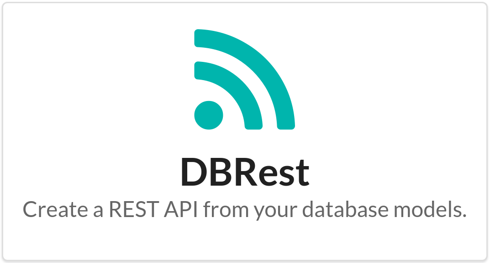
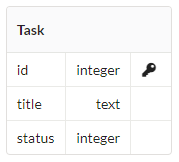

# [](assets/greeting.png)


## Install

```
$ npm install --save dbrest
```


## Connection
> Supported databases: Postgresql and MSSQL.

```js
const {DBRest, Model} = require('dbrest');
const dbrest = new DBRest({
    dialect: 'postgresql',
    connection: {
	    server: 'localhost',
	    port: '5432',
	    database: 'dbrest',
	    user: 'postgres',
	    password: 'postgres'
	}
});
await dbrest.connect();
```

## Database table example

[](assets/task.png)


## Define your Model
> For a basic example, just create a class that extends `Model`.

```js
class Task extends Model {}

dbrest.loadModel(Task);
const router = dbrest.publish();

//attach dbrest routes to your express app
app.use('/', router);
```

## Result
> It creates a REST API for CRUD operations.

HTTP Verb | Operation | Route
------------ | ------------- | -------------
GET | get tasks from database. | /task
POST | insert a task | /task
PUT | update a task | /task
DELETE | delete a task | /task

> Aditional methods

HTTP Verb | Operation | Route
------------ | ------------- | -------------
GET | get task schema | /task/define
GET | get task schema and data | /task/fetch


## Customize Model methods (find, insert, update, delete)
> let's see how to re-define the default methods

##### find
```js
class Task extends Model {

	//re-define find to add a calculated column `foo`.
	async find (params) {

		//`addWhereExpress` helps to generate `where` expression based on the request params 
		const statement = this.addWhereExpress(
			`select id, title, status, 'foo' as calculated from Task`,
			params
		);
		
		return await this.database.query(statement);
	}
}
```

##### insert
```js
class Task extends Model {

	//re-define insert to validate params
	async insert (params) {

		if (params.status != 'backlog') {
			throw new ModelError("a new task must be created with status 'backlog'.")
		}

		super.insert(param);
	}
}
```

##### update
```js
class Task extends Model {

	//re-define update to log changes in console
	async update (params) {

		console.log('[UPDATED] - ' + params);
		super.update(params);
	}
}
```

##### delete
```js
class Task extends Model {

	//re-define delete to validate references
	async delete (params) {
		const id = params.id;
		const reference = await this.database.query(`select id from event where taskId = ${id}`);
		if (reference) {
			throw new ModelError('this record is referenced by ' + reference.id);
		}

		super.delete(params);
	}
}
```


## MSSQL connection example

```js
const dbrest = new DBRest({
	dialect: 'mssql',
	connection: {
		userName: 'admin',
		password: 'admin',
		server: 'localhost',
		options: {
		  database: 'MyDB',
		  instanceName: 'SQLSERVEREXPRESS',
		  rowCollectionOnRequestCompletion: true
		}
	}
});
```


## API

### connect()

Connect to database and create a connections pool.


### loadModel(model)

#### model

*Required*  
Type: `Object`

Javascript class that extends Model.


### loadFrom(modelsDir)

#### modelsDir

*Required*
Type: `String`

Directory path containing the Models.


### publish(middleware)

#### middleware

*Optional*
Type: `function`  

Express middleware function.


## Warning

This project is in development, so be careful and don't use it in production yet. 


## License

MIT © [Danilo Sampaio](http://github.org/danilosampaio)
